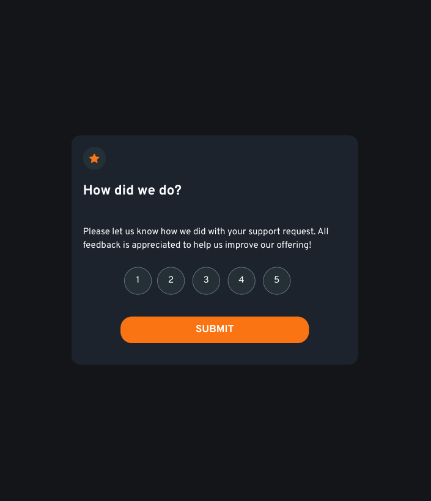
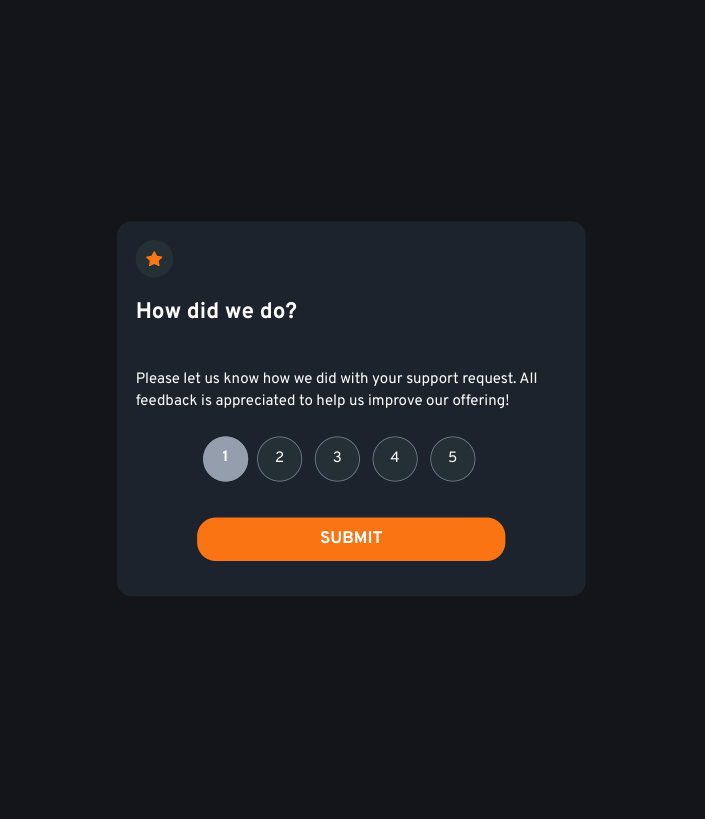
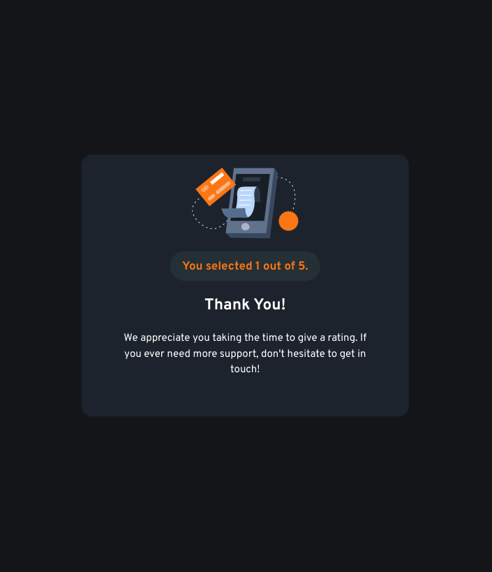

# Frontend Mentor - Interactive rating component solution

This is a solution to the [Interactive rating component challenge on Frontend Mentor](https://www.frontendmentor.io/challenges/interactive-rating-component-koxpeBUmI). Frontend Mentor challenges help you improve your coding skills by building realistic projects. 

## Table of contents

- [Overview](#overview)
  - [The challenge](#the-challenge)
  - [Screenshot](#screenshot)
  - [Links](#links)
- [My process](#my-process)
  - [Built with](#built-with)
  - [What I learned](#what-i-learned)
  - [Useful resources](#useful-resources)

## Overview

### The challenge

Users should be able to:

- View the optimal layout for the app depending on their device's screen size
- See hover states for all interactive elements on the page
- Select and submit a number rating
- See the "Thank you" card state after submitting a rating

### Screenshot

### Links

- Live Site URL: [Github Pages](https://jdegand.github.io/interactive-rating-component)

## My process

### Built with

- Semantic HTML5 markup
- CSS custom properties
- Mobile-first workflow

### What I learned

- I tried to reuse custom radio buttons that I used in Filter Modal UI Design Daily design.
- I wanted to use semantic html and use an actual radio input vs the codepen linked below which has the correct look of this design's radio buttons but no semantic value & accessibility.  I just made the label's text the same color as the background and prevented the text from being highlighted. 
- Used a CSS Counter to get the numbers inside as the content of the label::before.  

### Useful resources

- [A11y WIth Lindsey Blog](https://www.a11ywithlindsey.com/blog/create-custom-keyboard-accessible-radio-buttons) - custom accessible radio buttons
- [Slider Revolution](https://www.sliderrevolution.com/resources/styling-radio-buttons/) - Styling radio buttons
- [Codepen](https://codepen.io/tobiasdev/pen/XgegoO) - Tobias Bogliolo example of custom radio buttons 
- [Stack Overflow](https://stackoverflow.com/questions/826782/how-to-disable-text-selection-highlighting) - user-select property
- [CSS Tricks](https://css-tricks.com/displaying-the-current-step-with-css-counters/) -  CSS Counters
- [TechieDelight](https://www.techiedelight.com/get-value-of-selected-radio-button-javascript/) - get selected radio button
- [Coderwall](https://coderwall.com/p/nygghw/don-t-use-innerhtml-to-empty-dom-elements) - dont use innerHTML = "&nbsp;"
- [Geeks for Geeks](https://www.geeksforgeeks.org/remove-all-the-child-elements-of-a-dom-node-in-javascript/#:~:text=Child%20nodes%20can%20be%20removed,which%20produces%20the%20same%20output.) - remove all child elements of a DOM node
- [UX Movement](https://uxmovement.com/buttons/the-myths-of-color-contrast-accessibility/) - color contrast accessibility
